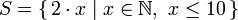

# 列表进阶

### Ranges

Range 是构造 List 的方法之一，其中的值必须是可枚举的。如 1、2、3..是可枚举的，字母表 A .. Z 是所有字符的枚举。而名字就不可以枚举了，比如"john"后面是谁并不知道。

使用 Range 符号`..`创建从 1 到 10 的列表：

```shell
ghci> [1..10]
[1,2,3,4,5,6,7,8,9,10]
```

创建字符 a 到 z 的列表：

```shell
ghci> ['a'..'z']
"abcdefghijklmnopqrstuvwxyz"
```

#### 设置步长

Range 允许声明一个步长，仅需要用逗号将前两个元素隔开，再标上上限即可。

获取 1 到 20 之间的所有偶数：

```shell
ghci> [2, 4..20]
[2,4,6,8,10,12,14,16,18,20]
```

Range 步长只能标明一次，意味着无法通过`[1, 2, 4..100]`这样的语句来获取所有 2 的幂。

```shell
ghci> [1, 2, 4..100]

<interactive>:2:9: error: parse error on input ‘..’
```

要得到倒序的列表，如 20 - 1 的列表使用`[20..1]`是不可以的，必须得`[20, 19..1]`。

```shell
ghci> [20..1]
[]
ghci> [20, 19..1]
[20,19,18,17,16,15,14,13,12,11,10,9,8,7,6,5,4,3,2,1]
```

Range 中使用浮点数要格外小心，出于定义的原因，浮点数并不精确。若使用浮点数，可能会得到意料之外的结果。

```shell
ghci> [0.1, 0.3, 1]
[0.1,0.3,0.5,0.7,0.8999999999999999,1.0999999999999999]
```

#### 无限 List

Range 可以通过不标明上限，从而得到一个无限长度的 List。

```shell
ghci> take 3 [1..]
[1,2,3]
```

> 由于 Haskell 是惰性的，它并不会立刻对无限长度的 List 求值，而是在获取内容时，需要多少元素就求取多少元素。

以下是几个可以生成无限 List 的函数：

**cycel**：对 List 无限复制

```shell
ghci> take 6 (cycle [1, 2, 3])
[1,2,3,1,2,3]
```

**repeat**：返回由接收参数组成的无限 List

```shell
ghci> take 3 (repeat 6)
[6,6,6]
```

### 列表推导

Haskell 中的列表推导与离散数学中的集合推导非常相似。

集合推导公式：



列表推导取前 10 个偶数：

```shell
ghci> [x * 2 | x <- [1..10]]
[2,4,6,8,10,12,14,16,18,20]
```

添加多个 List：

```shell
ghci> [x * y | x <- [1, 2, 3], y <- [1, 2]]
[1,2,2,4,3,6]
```

#### 限制条件

列表推导中可以添加限制条件来进行过滤：

```shell
ghci> [x * 2 | x <- [1..3], x * 2 > 4]
[6]
```

添加多个限制条件：

```shell
ghci> [x | x <- [2..5], x /= 3, x /= 4]
[2, 5]
```
